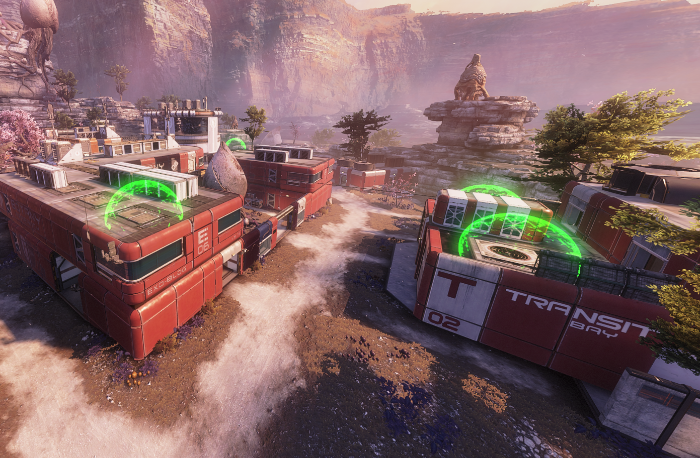
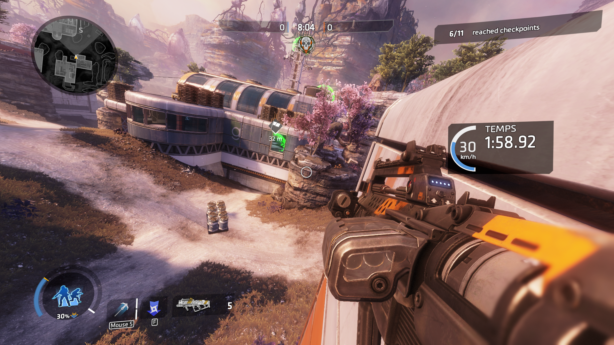
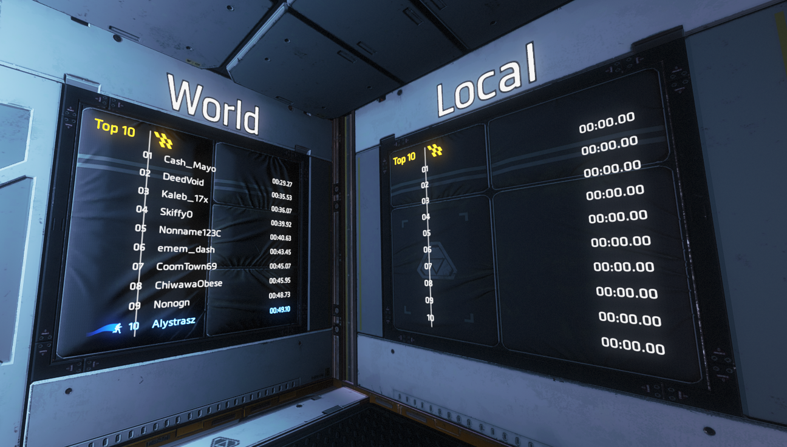

# Parkour

A gamemode where players have to cross checkpoints and race between each other for the leaderboard 1st position. Remember single player mission [The Pilot's Gauntlet](https://titanfall.fandom.com/wiki/The_Pilot's_Gauntlet)? Well, it's the same story, but in multiplayer!

## Game mode

### Rules

All you need to do is cross the starting line, cross all checkpoints and reach the finish line as fast as you can!

For games to be fair, all players have the same loadout: same weapon, same grenade, same ability and same kit.

### Interface

When you start a parkour run, several elements appear on your HUD:
* the number of checkpoints you validated;
* your current time and speed;
* a icon showing location of the next checkpoint (here, it's hidden in the building in front of us).

### Leaderboards

Scores of all players are displayed on leaderboards, not far from starting and finish lines. There are two leaderboards:
* the **local** leaderboard displays scores for the current match;
* the **world** leaderboard displays scores of all times for the current map.

## Development

Feel free to contribute!

Progress is tracked in this [GitHub board](https://github.com/users/Alystrasz/projects/1).

### Map configuration

Map configuration (*i.e.* coordinates of all entities, including start/finish lines, checkpoints and ziplines) is fetched from the [Parkour API](https://github.com/Alystrasz/parkour-api).

To locally create a new parkour route, you can make your local server load map configuration from a local JSON file instead by following the [local setup guide](./docs/LOCAL.md).
